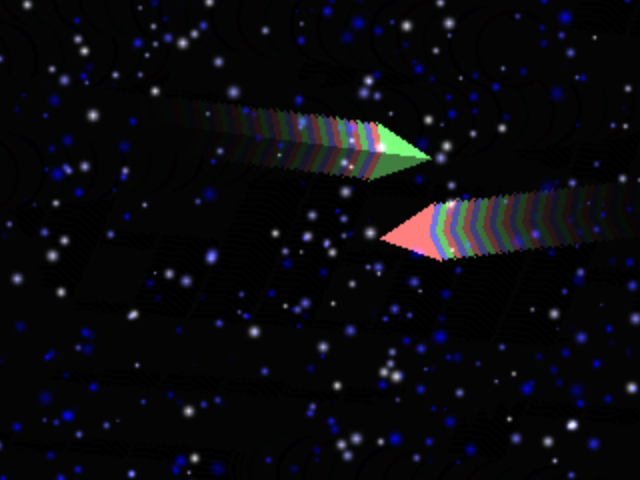

PowPow
======

This is a sample game for the [HappyFunTimes party games system](http://greggman.github.io/HappyFunTimes).

A space wars style game. The first 6 players battle it out. If there are more than 6 players they wait
in the *launch* queue. They collectively control a ghost ship they can use to try to kill other players
so they can get back into the game.

Cloning
-------

Prerequisites

*   node.js http://nodejs.org
*   bower http://bower.io
*   happyFunTimes http://superhappyfuntimes.net/install
*   hft-cli http://github.com/greggman/hft-cli

If you clone this you'll need follow the following steps

1.  install happyFunTimes http://superhappyfuntimes.net/install
2.  install node.js http://nodejs.org/download/
3.  install hft-cli by typing `sudo npm install -g hft-cli`
4.  install bower by typing `sudo npm install -g bower`
5.  clone this repo
6.  After cloning cd to the folder you just cloned into and type `bower install`
7.  edit `package.json` and change the `gameId` to some other id.
8.  type `hft add` which will add this to happyFunTimes.

